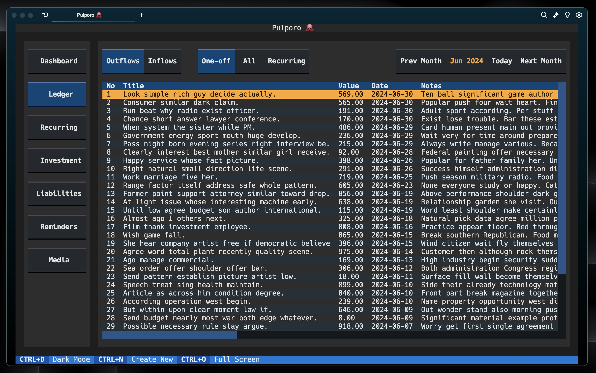

# Pulporo-TUI: Your Financial Freedom Companion (Pre-Alpha)
## Are you tired of juggling between ugly spreadsheets or dealing with shallow apps that offer confusing pie charts? 

Say hello to Pulporo - the go-to for startup-minded individuals seeking clarity and control. 
With Pulporo, managing finances isn't just about numbers; it's about gaining true financial freedom.


<small>Disclaimer: The image displayed represents a potential appearance and features of Pulporo. Actual app appearance and functionality may vary. </small>

If you want to read about features [Pulporo API](https://github.com/Zimzozaur/Pulporo-API)

## How to install and set up the project
### Install Python and SQLite (if needed)
**Python 3.12 Installation:**
   - Download Python 3.12 from the [official Python website](https://www.python.org/downloads/) and follow the installation instructions for your operating system.


### Project Setup (Under 1 min)
1. Clone this project
   ``` bash
   git clone https://github.com/Zimzozaur/Pulporo-TUI
   ```
2. Move to project
    ```
    cd Pulporo-TUI
    ```
3. Create virtual env in project directory 
   ```
   python -m venv venv
   ```
4. Activate virtual env:
   - **Mac/Linux:**
     ```bash
     source venv/bin/activate
     ```
   - **Windows (PowerShell):**
     ```powershell
     .\venv\Scripts\Activate.ps1
     ```
5. Install dependencies from requirements.txt
   ```
   pip install -r requirements.txt
   ```
6. Run app in terminal - Before run [Pulporo API](https://github.com/Zimzozaur/Pulporo-API?tab=readme-ov-file#project-setup-under-1-min) server
   ```
    python main.py
   ```

## Find a bug?

If you found an issue or would like to submit an improvement to this project, please submit an issue using the issues tab above. If you would like to submit a PR with a fix, reference the issue you created!
